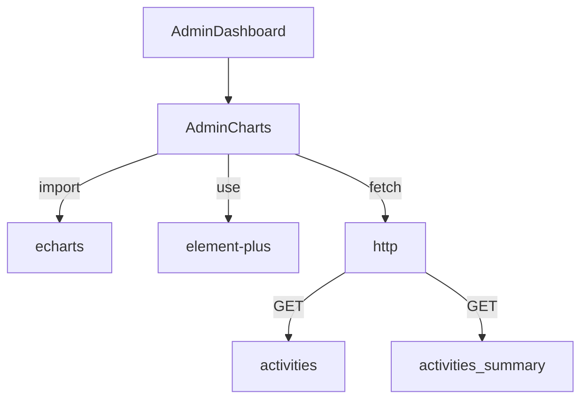

# 管理员仪表盘图表升级设计 (AdminDashboardCharts)

## 整体架构图

```mermaid
flowchart LR
  A[AdminDashboard.vue] --> B[AdminCharts.vue]
  B --> C[ECharts 实例: Line/Bar/Heatmap/Scatter]
  B --> D[HTTP API]
  D --> D1[/api/admin/activities]
  D --> D2[/api/admin/activities/summary]
  D1 --> E[前端聚合器]
  D2 --> E
  E --> C
```

## 分层设计与核心组件

- 视图层：AdminDashboard.vue（总览与承载图表区）
- 图表区：AdminCharts.vue（控件、数据获取、聚合、ECharts 渲染）
- 数据层：HTTP 客户端 `src/api/http.ts`（已存在）
- 可视化：ECharts 图表实例（折线、柱状、热力图、散点）

## 模块依赖关系图



## 接口契约定义

- GET `/api/admin/activities`
  - 响应：`{ items: Array<{ id, title, category?, mentorName?, startAt?, limit? }> }`
- GET `/api/admin/activities/summary`
  - 响应：`{ items: Array<{ id, registeredCount }> }`

## 数据流向图

```mermaid
flowchart LR
  API1[/admin/activities] -->|items| J[活动列表]
  API2[/admin/activities/summary] -->|items| K[报名汇总]
  J & K --> L[前端聚合]
  L --> M1[折线（日/小时）]
  L --> M2[柱状（类别/导师）]
  L --> M3[热力图（周-时）]
  L --> M4[散点（容量-报名）]
```

## 异常处理策略

- 接口失败：ElementPlus Message 反馈错误；图表保持空数据渲染
- 数据字段缺失：采用默认值（如分类“未分类”、导师“未知导师”、注册数 0）
- 响应式处理：窗口 resize 时图表同步 resize