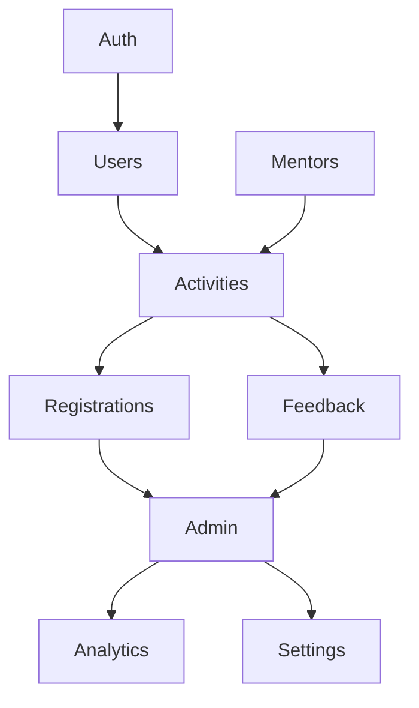
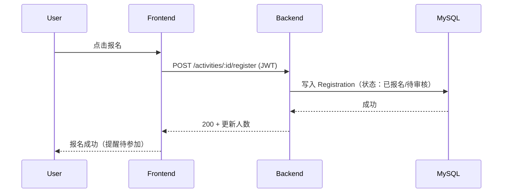
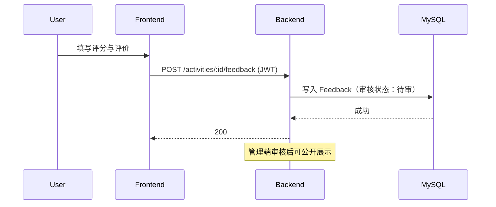

# 导师进书院活动系统 — 设计文档

## 整体架构图（Mermaid）
```mermaid
flowchart LR
  A[Browser / Vue3 SPA] --> B[Frontend App \n Vue Router / Pinia / Element Plus]
  B -->|REST| C[Backend API \n NestJS (Node.js)]
  C --> D[(MySQL DB)]
  C --> E[Storage/Export \n Excel/CSV]
  C --> F[Auth Service \n JWT / OAuth2 SSO]
  F --> C
  G[Admin Dashboard] --> C
```

## 分层设计与核心组件
- 表现层（Frontend）：路由（用户端/管理端）、状态管理（Pinia）、组件库（Element Plus）。
- 应用层（Backend）：业务用例（活动管理、报名、审核、反馈、分析）。
- 领域层（Domain）：实体与聚合（User、Mentor、Activity、Registration、Feedback）。
- 基础设施层（Infra）：数据库访问（Prisma/TypeORM）、鉴权（JWT/SSO）、日志与监控、文件导出。

## 模块与依赖关系（Mermaid）


## 前端页面结构
- 学生端
  - 登录/注册、用户中心
  - 活动广场（列表、筛选、搜索）
  - 活动详情（报名/取消、收藏）
  - 我的活动（报名、待参加、历史）
  - 导师风采（名录与详情）
  - 反馈表（已参加活动）
- 管理端
  - 仪表盘（数据总览、待办）
  - 活动管理（创建/编辑/复制、状态流转）
  - 报名管理（名单查看、审核、导出）
  - 导师管理（导师库）
  - 用户管理（启用/禁用）
  - 反馈与分析（评价审核、统计报表）
  - 系统设置（公告、权限）

## 后端接口契约（概要）
- Auth
  - POST `/auth/register`：学号注册。
  - POST `/auth/login`：账号密码登录，返回 JWT。
  - GET `/auth/sso/callback`：SSO 登录回调。
- Users
  - GET `/users/me`、PATCH `/users/me`。
  - GET `/admin/users`、PATCH `/admin/users/:id/status`。
- Mentors
  - GET `/mentors`、GET `/mentors/:id`。
  - POST/PATCH/DELETE `/admin/mentors`。
- Activities
  - GET `/activities`（筛选：导师、类型、时间、状态、关键词）。
  - GET `/activities/:id`。
  - POST/PATCH `/admin/activities`、POST `/admin/activities/:id/copy`。
  - PATCH `/admin/activities/:id/status`（草稿/已发布/报名中/已截止/已结束/已取消）。
- Registrations
  - POST `/activities/:id/register`、DELETE `/activities/:id/register`。
  - GET `/admin/activities/:id/registrations`、PATCH `/admin/registrations/:rid`（审核）。
  - GET `/admin/activities/:id/registrations/export`（Excel）。
- Feedback
  - POST `/activities/:id/feedback`。
  - GET `/admin/activities/:id/feedback`、PATCH `/admin/feedback/:fid`（审核）。
- Analytics
  - GET `/admin/analytics/overview`（近期活动数、报名人次、活跃用户数、满意度）。
  - GET `/admin/analytics/hot-activities`、`/popular-mentors`、`/user-engagement`。
  - POST `/admin/analytics/report`（生成报告）。
- Settings
  - GET/POST `/admin/announcements`。
  - GET/POST `/admin/roles`（权限配置）。

## 数据流向图（报名流程）


## 数据流向图（反馈流程）


## 异常处理策略
- 认证与授权：未登录返回 401；无权限返回 403；管理员接口都需角色校验。
- 输入校验：统一参数校验与错误码（400）；活动状态与报名时间合法性校验（422）。
- 防刷与限流：按 IP/用户进行节流；关键接口设置速率限制与验证码（如有必要）。
- 幂等与冲突：重复报名返回 409；名额满返回 409；并发报名使用数据库约束保障一致性。
- 安全：JWT 过期刷新、XSS/CSRF 防护（前后端协作）、文件导出权限校验。
- 日志与监控：结构化日志、审计关键操作（报名、审核、权限变更）、错误追踪。

## 设计可行性与对齐
- 与现有架构：前后端分离、REST API、MySQL 数据库，符合学院常见部署形态。
- 版本兼容：Node ≥ 18、Vue 3、MySQL 8；后续可提供 Spring Boot 备选实现。
- 扩展性：模块化设计，便于后续增加如签到、证书、消息通知等能力。