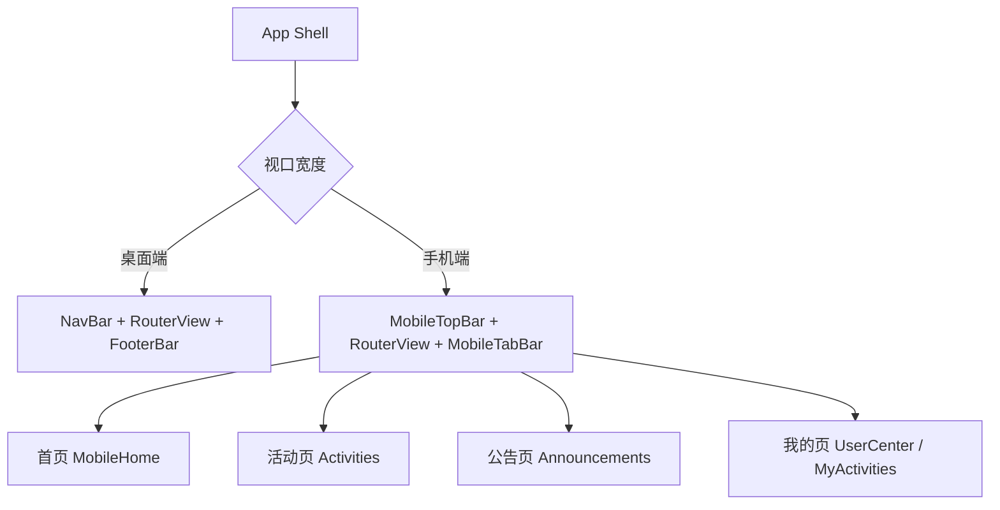
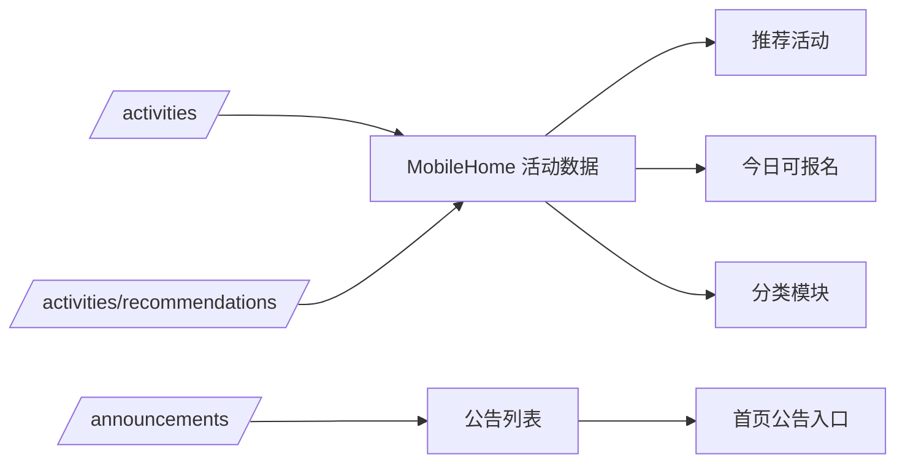

# 手机端首页聚合改版设计

## 整体结构

## 模块划分

### 1. App Shell

- 在 `App.vue` 中根据手机端状态切换全局导航外壳。
- 手机端隐藏桌面顶栏和页脚，改为顶部轻量栏与底部 Tab。

### 2. 首页模块

- `MobileHome.vue`
- 复用 `HomeHeroCarousel.vue`
- 数据来源：
  - `GET /activities`
  - `GET /activities/recommendations`
  - `GET /announcements`

首页展示顺序：

- Banner
- 快捷入口
- 为你推荐
- 今日可报名
- 分类活动分区

### 3. 通用组件

- `MobileTopBar.vue`：统一移动端顶部品牌栏与右侧入口。
- `MobileTabBar.vue`：首页、活动、公告、我的四个底部入口。
- `MobileQuickEntryGrid.vue`：四宫格快捷入口。
- `MobileActivityCard.vue`：推荐卡与列表卡的统一卡片组件。

### 4. 页面适配

- `Announcements.vue`：手机端切换为单列紧凑卡片。
- `ActivityDetail.vue`：手机端使用信息分块 + 底部固定 CTA。
- `UserCenter.vue`：手机端调整标题、信息块与操作按钮布局。
- `MyActivities.vue`：手机端分页与标签页保持可用，卡片单列化。

## 数据流

## 风险控制

1. 不改后端接口，优先复用现有字段，降低联调成本。
2. 桌面端结构尽量保持不变，避免引入跨端回归。
3. 移动端样式优先通过新增类名和组件隔离，减少对现有桌面样式的污染。
