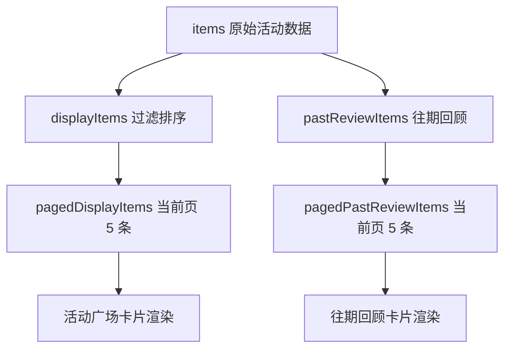

# 活动广场优化设计

## 整体方案

本轮采用“最小风险增量改造”：
- 保留 `items -> displayItems / pastReviewItems` 的现有数据流。
- 在前端增加分页状态，将“活动广场”和“往期回顾”分别切成 5 条一页。
- 在列表图片上启用懒加载，减少首屏资源请求与渲染压力。

## 模块划分

1. 数据层
- `items`：保留原始活动数据。
- `displayItems`：活动广场过滤排序后的完整结果。
- `pastReviewItems`：往期回顾完整结果。

2. 分页层
- `activityPage`：活动广场当前页。
- `reviewPage`：往期回顾当前页。
- `pagedDisplayItems`：活动广场当前页切片结果。
- `pagedPastReviewItems`：往期回顾当前页切片结果。

3. 交互层
- `handleActivityPageChange(page)`：切换活动广场页码。
- `handleReviewPageChange(page)`：切换往期回顾页码。
- `watch([keyword, selectedCategories, onlyAvailable, sortKey])`：条件变化时重置活动广场到第一页。

## 数据流

## 关键实现点

- 使用 `sliceByPage(list, page, pageSize)` 统一分页切片逻辑。
- 使用 `el-pagination` 作为分页器，分页器仅在总数超过页容量时显示。
- 使用 `el-image lazy` 让活动广场与往期回顾的图片按需加载。
- 使用 `watch` 在筛选条件变化或结果总数收缩时纠正页码，避免空页。

## 风险控制

- 不改 Timeline、推荐和类别模块，避免当前首页导览逻辑回归。
- 不改后端接口，避免影响既有移动端或其他页面依赖。
- 如果后续数据量继续增长，再进入服务端真分页阶段。
