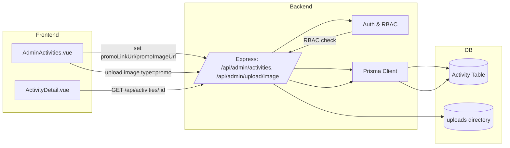
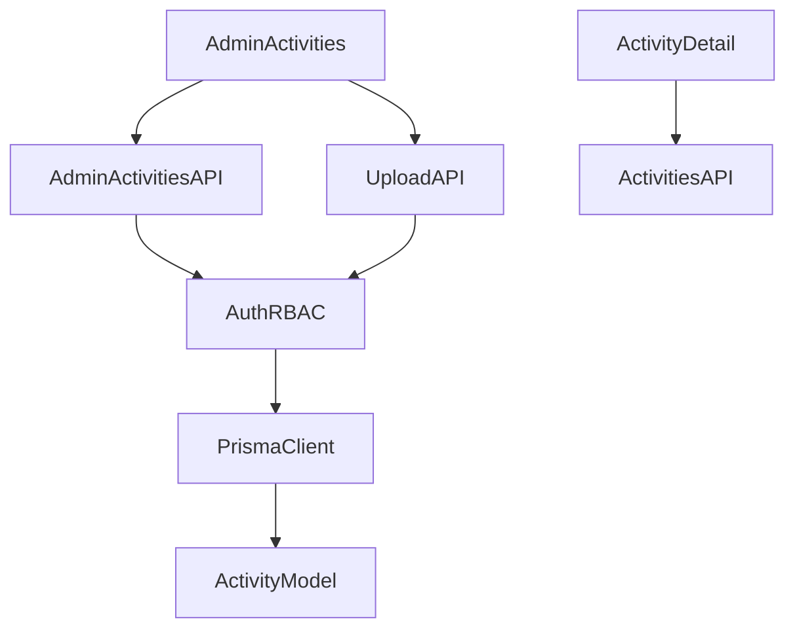
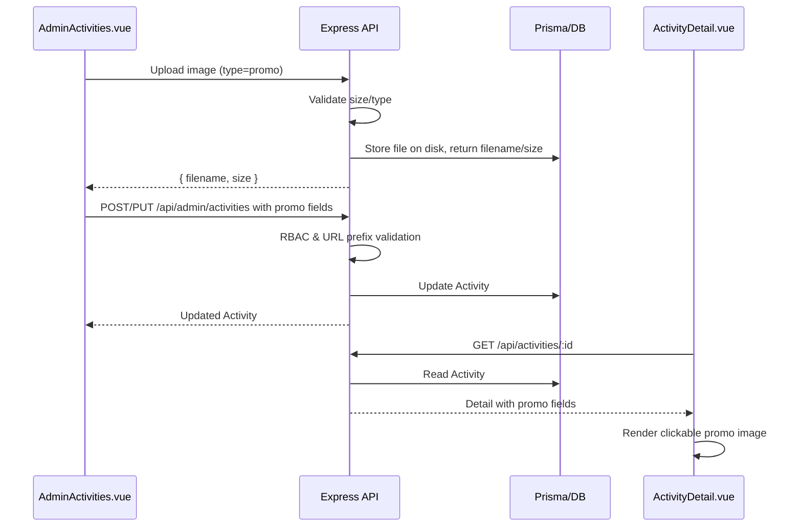

# 设计文档：活动推文推广功能

## 整体架构图

## 分层设计与核心组件
- 前端：
  - AdminActivities.vue：表单双向绑定、权限显隐、URL 校验、图片上传预览。
  - ActivityDetail.vue：推广区条件渲染、图片点击跳转、移动端自适应。
- 后端：
  - `/api/admin/upload/image`：支持 `type=promo`，限制 10MB，返回文件名与大小。
  - `/api/admin/activities`：POST/PUT 校验权限（OWNER_PRIMARY、SUPERVISOR、MENGSUILIANYUN），校验 URL 前缀。
  - Prisma 模型扩展与迁移部署。

## 模块依赖关系图

## 接口契约定义
- POST/PUT `/api/admin/activities`
  - Request（部分字段）：
    - `promoLinkUrl`?: string (必须以 http/https 开头)
    - `promoImageUrl`?: string
    - `promoImageSizeBytes`?: number
  - RBAC：仅 OWNER_PRIMARY、SUPERVISOR、MENGSUILIANYUN 可设置上述字段；其他角色设置将返回 403。
  - Response：标准活动对象，包含上述字段。

- POST `/api/admin/upload/image?type=promo`
  - Body：`multipart/form-data`，字段名 `file`
  - 约束：图片大小 ≤ 10MB；类型 JPEG/PNG/WebP
  - Response：`{ filename: string, size: number }`

- GET `/api/activities/:id`
  - Response：活动详情对象包含 `promoLinkUrl`, `promoImageUrl`, `promoImageSizeBytes`（可选）。

## 数据流向图

## 异常处理策略
- 上传失败（大小/类型非法）：前端给出错误提示；后端返回 400。
- RBAC 不通过：后端返回 403；前端隐藏字段并在强制提交时提示无权限。
- URL 非法：后端返回 400；前端也做前置校验只允许 http/https。
- 图片缺失或链接缺失：用户端不显示推广区。

## 兼容性与版本
- 前后端框架与依赖保持现有版本；Prisma provider 为 MySQL。
- 代码风格与现有项目保持一致；不引入不兼容特性。