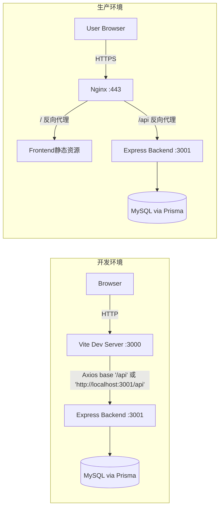

# 登录联调与部署验证（DESIGN）

## 整体架构（Mermaid）


## 分层设计与核心组件
- 前端层：
  - src/api/http.js：Axios 实例，附带 Bearer token，401 自动路由到登录页。
  - src/router/index.js：路由守卫，requiresAuth、requiresAdmin 访问控制。
  - views/AdminLogin.vue、views/Login.vue：登录表单与校验规则。
- 服务层（后端）：
  - /api/auth/login：学生登录。
  - /api/admin/auth/login：管理员登录（studentId、password、level）。
  - /api/users/me：令牌获取用户信息。
  - /api/health：健康检查。
- 反向代理层（生产）：
  - Nginx 将 /api 转发至后端 3001，同源策略，避免跨域问题。

## 模块依赖关系图
```mermaid
flowchart TD
  HTTP[http.js Axios] --> RouterGuard[Router Guards]
  AdminLogin --> HTTP
  Login --> HTTP
  RouterGuard --> UsersMe[/api/users/me]
  AdminLogin --> AdminAuth[/api/admin/auth/login]
  Login --> AuthLogin[/api/auth/login]
```

## 接口契约定义（简版）
- POST /api/auth/login
  - body: { studentId: string(12 digits), password: string(6-12 alnum) }
  - resp: { token: string }
- POST /api/admin/auth/login
  - body: { studentId: string, password: string, level: '梦碎怜云'|'主管老师'|'第一负责人'|'第二负责人'|'普通干事' }
  - resp: { token: string }
- GET /api/users/me
  - headers: Authorization: Bearer <token>
  - resp: { id, studentId, name, role, adminLevel, ... }
- GET /api/health
  - resp: { ok: true }

## 数据流向
1. 登录页提交表单 -> http.js 将请求发往 baseURL（/api 或 <VITE_BACKEND_URL>/api）。
2. 后端校验凭据 -> 生成 JWT -> 前端保存至 localStorage。
3. 路由守卫在访问受限页面前调用 /api/users/me 验证权限。

## 异常处理策略
- 401：http.js 拦截器跳转登录页，并附带 redirect 参数。
- VALIDATION_ERROR 与 FORBIDDEN：在 UI 展示后端返回的 message。
- 跨域问题：生产坚持同源（/api 代理），开发环境允许跨域（后端已启用 CORS）。