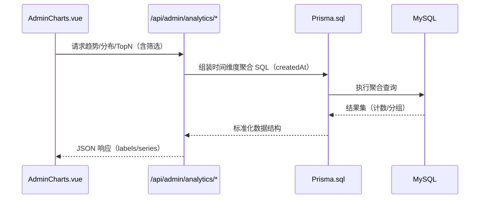

# 部署上线与后端聚合增强 - 设计文档

## 整体架构（Mermaid）
```mermaid
flowchart LR
  User[用户/管理员浏览器] -->|HTTP 80/443| Nginx[(Nginx 站点: mentor-academy)]
  Nginx -->|静态资源| FE[/var/www/mentor-academy/frontend]
  Nginx -->|/api/* 反向代理| BE[Express @ :3001]
  BE --> Prisma[(Prisma Client)]
  Prisma --> MySQL[(MySQL 数据库)]
```

## 分层与核心组件
- 前端静态层：Vite 构建产物（dist），包含管理仪表盘与图表页更新。
- 反向代理层：Nginx 站点配置，根目录指向前端静态目录，/api/* 代理后端。
- 应用服务层：Express 应用，新增聚合分析接口。
- 数据访问层：Prisma + 原生 SQL（`Prisma.sql`），高效时间维度聚合。

## 模块依赖关系
- FE 依赖 BE 提供的分析接口（JWT 认证）。
- Nginx 作为入口，协调 FE 静态与 BE API 访问。
- BE 依赖 MySQL，借助 Prisma 管理模型与查询。

## 接口契约定义
1. GET `/api/admin/analytics/registrations/by-day`
   - Query: `days`(1-180, 默认30), `statuses`(枚举集合), `category`(模糊), `mentor`(模糊)
   - Auth: Bearer JWT（ADMIN）
   - Response: `{ labels: string[], series: number[], range: { start, end } }`
2. GET `/api/admin/analytics/registrations/by-hour`
   - Query: `date`(YYYY-MM-DD), `statuses`, `category`, `mentor`
   - Response: `{ labels: string[24], series: number[24], date }`
3. GET `/api/admin/analytics/registrations/status-by-day`
   - Query: `days`, `category`, `mentor`
   - Response: `{ labels: string[], series: { REGISTERED:number[], PENDING_CANCEL:number[], CANCELED:number[] } }`
4. GET `/api/admin/analytics/registrations/top`
   - Query: `dimension`('category'|'mentor'), `limit`(1-50), `days`(1-365), `statuses`
   - Response: `{ items: { key:string, count:number }[], range: { start, end } }`

## 数据流向图


## 异常处理策略
- 参数校验：非法 `date` 格式返回 400（`BAD_REQUEST`）。
- 权限校验：非管理员返回 403（`FORBIDDEN`）。
- 服务错误：统一返回 500（`SERVER_ERROR`），打印日志标记模块与接口名称。

## 设计合理性
- 复用现有 Express/Prisma 架构与鉴权体系，最小改动集成分析接口。
- 使用原生 SQL 聚合提升性能，避免 ORM 层循环与大量数据传输。
- 前端现有图表组件已扩展支持累计曲线、日历热力等渲染，接口契约与之对齐。